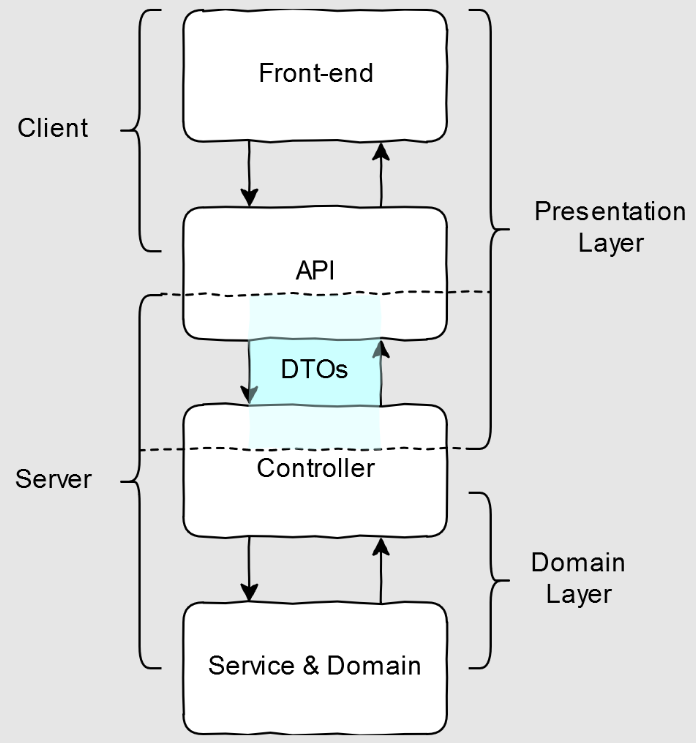

### Data Transfer Object

**Data Transfer Object (DTO) — один из шаблонов проектирования, используется для передачи
данных между подсистемами приложения.**

Data Transfer Object, в отличие от business object или data access object не должен содержать
какого-либо поведения.

**Зачастую, в клиент-серверных приложениях, данные на клиенте (слой представления) и на сервере
(слой предметной области) структурируются по-разному.** На стороне сервера это дает нам возможность
комфортно хранить данные в базе данных или оптимизировать использование данных в угоду
производительности, в то же время заниматься "user-friendly" отображением данных на клиенте, и,
для серверной части, нужно найти способ как переводить данные из одного формата в другой.

Конечно, существуют и другие архитектуры приложений, но мы остановимся на текущей в качестве
упрощения. DTO-подобные объекты могут использоваться между любыми двумя слоями представления
данных см. 

**DTO — это так называемый value-object на стороне сервера, который хранит данные, используемые в
слое представления.** DTO можно разделить на те, что мы используем при запросе (Request) и на те,
что мы возвращаем в качестве ответа сервера (Response).

Хорошие DTO помогают создавать API согласно лучшим практикам и в соответствие с принципом чистого кода.

DTO должны позволять разработчикам писать API, которое внутренне согласовано. Описание параметра на
одной из конечных точек (endpoint) должно применяться и к параметрам с тем же именем на всех связанных
точках. В качестве примера, если поле price при запросе определено как "цена с НДС", то и в ответе
определение поля price не должно измениться. **Согласованное API предотвращает ошибки, которые могли
возникнуть из-за различий между конечными точками.**

**DTO должны быть надёжными и сводить к минимуму необходимость в написании шаблонного кода.** Если при
написании DTO легко допустить ошибку, то вам нужно прилагать дополнительные усилия, чтобы ваше API
оставалось согласованным. **DTO должны "легко читаться", ведь даже если у нас есть хорошее описание
данных из слоя представления — оно будет бесполезно, если его тяжело найти.**

---
**Доп. материалы:**
- [The DTO Pattern (Data Transfer Object)](https://www.baeldung.com/java-dto-pattern)
- [The Complete Guide to Data Transfer Objects (DTOs): From Basics to Enterprise Patterns](https://medium.com/@alxkm/the-complete-guide-to-data-transfer-objects-dtos-from-basics-to-enterprise-patterns-fcddd3a6bc9a)
- [Data Transfer Object (DTO) in Spring MVC with Example](https://www.geeksforgeeks.org/java/data-transfer-object-dto-in-spring-mvc-with-example/)
- [How to Write Clean DTO & Entity Mappers in Java (with Spring Boot)](https://dev.to/gianfcop98/how-to-write-clean-dto-entity-mappers-in-java-with-spring-boot-5ac6)
- [What are Data Transfer Objects? Learn to Use DTOs in Your Java Spring-Based Projects](https://www.freecodecamp.org/news/what-are-dtos-java/)
- [Data Transfer Object Pattern in Java: Simplifying Data Exchange Between Subsystems](https://java-design-patterns.com/patterns/data-transfer-object/)
- [What are DTOs (Data Transfer Objects)](https://www.javacodegeeks.com/what-are-dtos-data-transfer-objects.html)
- [Ultimate Guide to Using DTOs with Spring Boot](https://bell-sw.com/blog/ultimate-guide-to-using-dtos-with-spring-boot/)
- [Data transfer object (from WIKI)](https://en.wikipedia.org/wiki/Data_transfer_object)
- [The DTO (Data Transfer Object)](https://examples.javacodegeeks.com/the-dto-data-transfer-object/)
- [The DTO Pattern (Data Transfer Objects)](https://medium.com/@orcunyilmazoy/the-dto-pattern-data-transfer-objects-8146b262636e)
- [Data Transfer Object Design Pattern in Java](https://www.javaguides.net/2018/08/data-transfer-object-design-pattern-in-java.html)
- [Distribution Patterns, DTO and Remote Facade](https://blog.devgenius.io/distribution-patterns-dto-and-remote-facade-b277b48b16f5)
- [Exploring DAO and DTO in Java: Key Concepts and Usage](https://www.index.dev/blog/what-are-dao-and-dto-in-java-explained)
