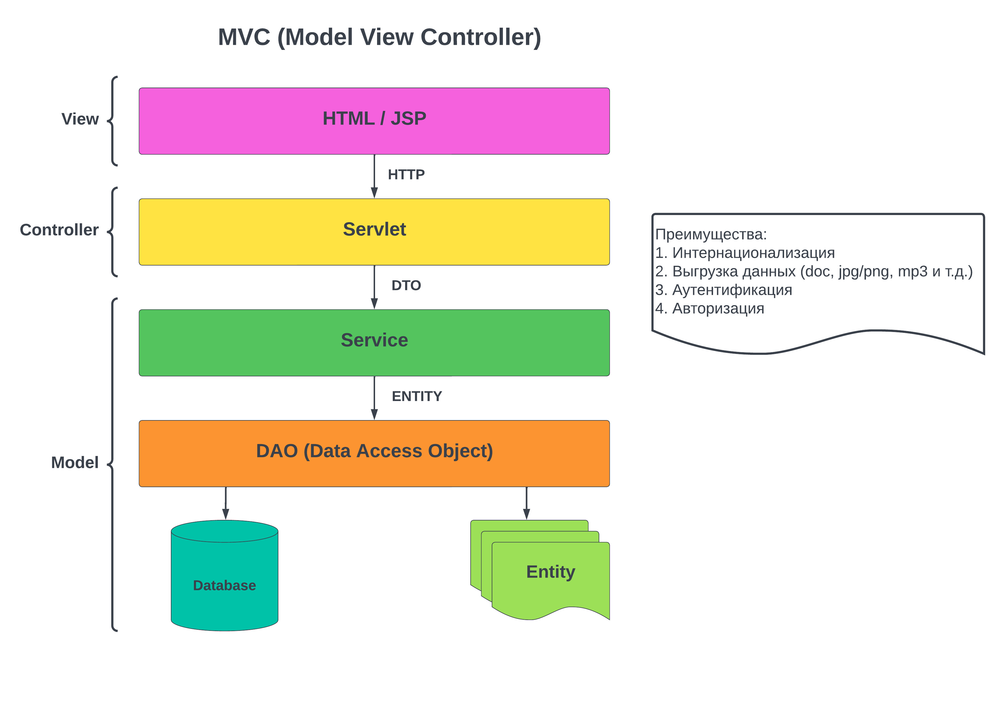

### Вспомогательные папки для всех разделов:

- [BASE](../MVCPractice/BASE) - SQL скрипты для создания и заполнения базы данных;
- [DOC](../MVCPractice/DOC) - описание концепции MVC в txt, jpg и png файлах (документация Lombok кратко, с примерами);
- [lib](../MVCPractice/lib) - файлы сторонних библиотек: lombok, postgresql - коннектор и библиотека servlet-api;
- [resources](../MVCPractice/resources) - папка ресурсов (в данном примере содержит только файл свойств);

---
### Часть 1 - Архитектурный подход MVC

- [src/AirportSimulator/](../MVCPractice/src/AirportSimulator) - основные модули программы (web-приложения) демонстрирующей принципы MVC:

    - [DAO](../MVCPractice/src/AirportSimulator/DAO) - папка содержит DAO-интерфейс и наши DAO классы, которые реализуют принципы CRUD: Create - создание, Read - чтение, Update - обновление, Delete - удаление;
    - [DTO](../MVCPractice/src/AirportSimulator/DTO) - папка содержит наши Data Transfer Object (DTO) классы (служат для передачи данных с одного слоя приложения на другой);
    - [Entity](../MVCPractice/src/AirportSimulator/Entity) - папка сущностей, описывающих записи в таблицах базы данных (перелеты, билеты, статусы перелетов и т.д.);
      
      - [EntityEnum](../MVCPractice/src/AirportSimulator/Entity/EntityEnum) - папка хранящая ENUM, с заранее обговоренными значениями полей.
    - [Service](../MVCPractice/src/AirportSimulator/Service) - папка с классами работающими между слоем Services и Servlets (передача нужной информации между слоями, необязательно всей доступной из базы данных); 
    - [Servlet](../MVCPractice/src/AirportSimulator/Servlet) - папка с сервлетами приложения;
    - [Util](../MVCPractice/src/AirportSimulator/Util) - папка содержит классы организующие связь с базой данных и чтения файла со свойствами;

При работе с IntelliJ IDEA данный проект нужно настроить, и только затем запустить:
1. Папку lib пометить как "Add as Library" и заполнить необходимыми библиотеками:

   - lombok.jar - для использования аннотаций, дабы не писать рутинный код;
   - postgresql-42.6.0.jar - драйвер для соединения java приложения и PostgreSQL базы данных;
   - servlet-api.jar - библиотека сервлетов, содержащая все необходимые классы для работы нашего WEB приложения;
2. В разделе "File" -> "Project Structure" среды разработки IntelliJ IDEA:

   - выбираем "Modules" в настройках проекта и добавляем "Web";
   - в том же разделе выбираем "Artifacts" и добавляем "Web Application: Exploded" и добавляем наш проект;

3. В браузере после запуска TomCat набираем http://localhost:8080/ и выбираем сервлет `/flights` как стартовый.

Графическую структуру архитектурного подхода MVC по принципу которого было выстроено данное приложение можно посмотреть на 

---
### Часть 2 - Перенаправление запросов (Request Redirect) и Cookies, Session, Attributes

- [DTO/UserDto.java](../MVCPractice/src/AirportSimulator/DTO/UserDto.java) - небольшой пример использования Lombok;
- [PartTwo/CookiesServlet](../MVCPractice/src/PartTwo/CookiesServlet/CookiesServlet.java) - краткий пример работы с cookies;
- [PartTwo/SessionServlet](../MVCPractice/src/PartTwo/SessionServlet/SessionServlet.java) - краткий пример работы с методами запроса, и демонстрация работы с сессией;
- [PartTwo/AttributeServlet](../MVCPractice/src/PartTwo/AttributeServlet/SessionAttribute.java) - пример работы с атрибутами, использование класса UserDto.java в качестве атрибута;
- [PartTwo/DispatcherServlet](../MVCPractice/src/PartTwo/DispatcherServlet) - бывают ситуации когда запрос (req) от клиента требует каких-то дополнительных манипуляций с ответом (resp) и тогда сервлет-диспетчер перенаправляет запрос на другой сервлет `req.getRequestDispatcher("/другой сервлет")`, который делает необходимую работу и формирует ответ клиенту, демонстрация трех типов перенаправления запросов (forward, include и redirect):

    - [ForwardRedirect](../MVCPractice/src/PartTwo/DispatcherServlet/ForwardRedirect.java) - демонстрация работы метода *.forward(req, resp), в данной ситуации сервлет диспетчер перенаправляет запрос-ответ (req, resp) на другой сервлет, который уже формирует ответ для сервера, и тот в свою очередь дает ответ клиенту (клиент не знает о перенаправлении);
    - [IncludeRedirect](../MVCPractice/src/PartTwo/DispatcherServlet/IncludeRedirect.java) - демонстрация работы метода *.include(req, resp), в котором, перенаправление запроса-ответа 'не происходит', сервлет на который был перенаправлен запрос выполняет свою работу, формирует ответ (resp) и возвращает его сервлету диспетчеру, и то в свою очередь возвращает ответ (resp) серверу, который отдает ответ клиенту (клиент не знает о перенаправлении, оно не отображается в браузере);
    - [FullRedirect](../MVCPractice/src/PartTwo/DispatcherServlet/FullRedirect.java) - в данном примере происходит полное перенаправление запроса от клиента диспетчером на сервлет который обрабатывает запрос (req) и формирует ответ (resp), при этом, само перенаправление, В ОТЛИЧИЕ ОТ ПЕРВЫХ ДВУХ ВАРИАНТОВ происходит ответом, а не запросом resp.sendRedirect("/другой сервлет") (клиент в браузере видит явное перенаправление на другую страницу);
    - [FlightDemoRedirectServlet](../MVCPractice/src/PartTwo/DispatcherServlet/FlightDemoRedirectServlet.java) - сервлет на который будет производиться 'перенаправление' запросов. 

---
### Часть 3 - JSP (Java Server Pages) создание и директивы

- [web/JspDemo/](../MVCPractice/web/JspDemo) - папка с [ticket.jsp](../MVCPractice/web/JspDemo/tickets.jsp) страницей (страницы данного типа *.jsp содержат некую динамику, не бизнес-логику, необходимую для работы web-приложения), которая является аналогом сервлета [TicketServlet.java](../MVCPractice/src/AirportSimulator/Servlet/TicketServlet.java). В идеале все *.jsp страницы должны находиться в папке `web/WEB-INF/` и доступ к ним из браузера закрыт.

    - page директива (jsp тэг) - используется для конфигурации нашей страницы, например: `<%@ page contentType="text/html;charset=UTF-8" language="java" %>`, задаем тип контента или импорт java классов необходимых для работы *.jsp страницы и т.п.  
    - taglib директива - используется для декларации (присоединения) необходимых для работы нашей страницы внешних библиотек (JSTL), например `<%@ taglib prefix="c" uri="путь к используемой библиотеке"%>`.
    - include директива - необходима чтобы включить в текущую страницу код другой страницы, например см. [content.jsp](../MVCPractice/web/WEB-INF/jsp/content.jsp): `<%@ include file="header.jsp"%>`.

- [PartThree/JspRedirect](../MVCPractice/src/PartThree/JspRedirect) - папка с демонстрационными сервлет файлами, которые перенаправляют методом `*.forward` на [web/WEB-INF/jsp/content.jsp](../MVCPractice/web/WEB-INF/jsp/content.jsp)
    
    - [ContentServletFirst](../MVCPractice/src/PartThree/JspRedirect/ContentServletFirst.java) - сервлет перенаправляет методом `*.forward(req,resp)` на страницу `content.jsp`, где адрес перенаправления прописан явно.
    - [ContentServletSecond](../MVCPractice/src/PartThree/JspRedirect/ContentServletSecond.java) - сервлет проделывает ту же работу, что и ContentServletFirst, однако мы применили тут самописный утилитный класс.
    - [ContentServletThird](../MVCPractice/src/PartThree/JspRedirect/ContentServletThird.java) - сервлет переадресовывающий (req, resp) на `*.jsp` страницу расположенную в `web/WEB-INF/jsp/`, для большей наглядности можно передать параметры в строке браузера (в качестве примера при моих настройках подключенного TomCat можно было использовать `http://localhost:8080/content-jstl-demo` с параметрами `?id=2&test=hello_from_jsp` например). 

- [PartThree/UtilHelper](../MVCPractice/src/PartThree/UtilHelper) - папка с утилитным классом JspPathHelper. Он нужен на случай, если при написании приложения нам придется часто обращаться к папке `web/WEB-INF/jsp/` или другим папкам внутри WEB-INF содержащей множество `*.jsp` файлов.

---
### Часть 4 - JSTL (JavaServer Pages Standard Tag Library) теория и практика, динамическая HTML форма регистрации

- [PartFour/JSTLServletDemo](../MVCPractice/src/PartFour/JSTLServletDemo) - папка содержит сервлеты демонстрирующие работу с JSTL, в данном случае происходит перенаправление на `*.JSP` файлы в папке:
  - [WEB_INF/JstlDemo](../MVCPractice/web/WEB-INF/JstlDemo) - где и применяются библиотеки JSTL тегов.
- [PartFour/RegForms](../MVCPractice/src/PartFour/RegForms) - раздел содержит сервлеты перенаправляющие пользователя на `*.JSP` формы регистрации (статические и динамические):
  - [WEB_INF/jspForms](../MVCPractice/web/WEB-INF/jspForms) - раздел содержит два вида регистрационных форм (с применением JSTL тегов). 

Стандартная библиотека тегов JSP (англ. JavaServer Pages Standard Tag Library, JSTL) - расширение спецификации JSP, добавляющее библиотеку JSP тегов для общих нужд, таких как разбор XML данных, условная обработка, создание циклов и поддержка интернационализации.

JSTL является альтернативой такому виду встроенной в JSP логики, как скриплеты, то есть прямые вставки Java кода. Использование стандартизованного множества тегов предпочтительнее, поскольку получаемый код легче поддерживать и проще отделять бизнес-логику от логики отображения.

Для работы с функциями, условными выражениями и т.д. из библиотек JSTL необходимо их скачать и разместить в папке `lib` это:

- `jakarta.servlet.jsp.jstl-3.0.1.jar` - библиотека функций (подключение к JSP странице `<%@taglib prefix="fn" uri="http://java.sun.com/jsp/jstl/functions" %>`);
- `jakarta.servlet.jsp.jstl-api-3.0.0.jar` - Jakarta core (подключение к JSP странице `<%@taglib prefix="c" uri="http://java.sun.com/jsp/jstl/core" %>`);

---
### Часть 5 - Валидация и сохранение содержимого регистрационной формы в базе данных

Возвращаемся к разделу [AirportSimulator](../MVCPractice/src/AirportSimulator), и расширим его.

Для начала работы над формой регистрации, из которой данные попадут в базу данных создадим необходимую таблицу пользователей в базе данных: 
SQL скрипт находится во вспомогательной папке [BASE/create_users_table.sql](../MVCPractice/BASE/create_users_table.sql). Естественно форма максимально упрощенная (например, пароль не защищен в момент передачи и виден в самой базе открытым текстом).
- [Entity](../MVCPractice/src/AirportSimulator/Entity) - добавляем в нашу папку сущностей новый класс [USER](../MVCPractice/src/AirportSimulator/Entity/User.java), используем [Lombok](../MVCPractice/DOC/Fast_Lombok.md), чтобы не писать шаблонный код (boilerplate code).
- [DAO](../MVCPractice/src/AirportSimulator/DAO) - добавляем новый [DAO](../MVCPractice/DOC/DAO.md) класс [UserDao](../MVCPractice/src/AirportSimulator/DAO/UserDao.java) и, пока, реализуем в нем метод для сохранения пользователя в базе.
- [DTO](../MVCPractice/src/AirportSimulator/DTO) - в раздел [DTO](../MVCPractice/DOC/DTO.md) добавляем класс [CreateUserDto](../MVCPractice/src/AirportSimulator/DTO/CreateUserDto.java) для создания нового пользователя (поскольку данные поступают из запроса как String нам придется его преобразовывать в нужный формат самим, в отличие от Spring-фреймворка).
- [Service](../MVCPractice/src/AirportSimulator/Service) - создаем в данном разделе класс [UserService](../MVCPractice/src/AirportSimulator/Service/UserService.java), который проводит простую валидацию введенных данных и преобразовывает объект DTO в DAO (т.е. спускаемся вниз по схеме см. 

- [Validator](../MVCPractice/src/AirportSimulator/Validator) - раздел содержит классы для обработки различных ошибок при заполнении формы регистрации пользователей. Предполагается, что данный раздел будет содержать некие универсальные случаи валидации ошибок.
- [Mapper](../MVCPractice/src/AirportSimulator/Mapper) - раздел содержит классы для преобразования одного класса в другой (DTO в DAO).
- [Util](../MVCPractice/src/AirportSimulator/Util) - добавляем в раздел класс LocalDateFormatter, который предназначен для превращения даты в формате String, в дату в формате LocalDate, удобный для базы данных.
- [Exception ](../MVCPractice/src/AirportSimulator/Exception)- раздел с нашими самописными исключениями. [ValidationException](../MVCPractice/src/AirportSimulator/Exception/ValidationException.java) - возвращает коллекцию возможных ошибок, пока, при работе с формой регистрации.
- [Servlet/UserRegForm](../MVCPractice/src/AirportSimulator/Servlet/UserRegForm) - раздел содержащий сервлеты форм перенаправляющий запросы пользователя на `*.JSP` страницы: 

    - [jstl_reg_form.jsp](../MVCPractice/web/WEB-INF/jsp/jstl_reg_form.jsp) - форма регистрации пользователя;

В данной ситуации, основная бизнес логика (например, валидация формы) работы приложения находится на локальном уровне Service, в глобальном разделе Model, т.е. мы попытались уйти от "толстого тупого контроллера", который очень сильно зависит от уровня Отображения - View и Модели - Model.

Продолжение в разделе: [AirportSimulatorTwo](../MVCPracticeAdvanced/src/AirportSimulatorTwo)

---
**Доп. материалы:**
- [Архитектурный паттерн MVC](https://doka.guide/tools/architecture-mvc/)
- [Знакомство с архитектурой MVC](https://javarush.com/quests/lectures/questservlets.level14.lecture02)
- [MVC](https://javarush.com/quests/lectures/questcollections.level06.lecture01)
- [Паттерн MVC в веб-разработке на Java](https://www.codorbits.com/course/mvc-pattern-in-java/)

---
- [Java Servlets: Understanding Sessions, Cookies, and URL Rewriting](https://prajwal018.medium.com/java-servlets-understanding-sessions-cookies-and-url-rewriting-ee866527601e)
- [Handling Cookies and a Session in a Java Servlet](https://www.baeldung.com/java-servlet-cookies-session)
- [Servlet: Request, Response, and Session](https://www.geeksforgeeks.org/advance-java/servlet-request-response-and-session/)
- [Session Management in Java - HttpServlet, Cookies, URL Rewriting](https://www.digitalocean.com/community/tutorials/java-session-management-servlet-httpsession-url-rewriting)
- [Servlet Session Management and Redirection](https://medium.com/@meowmbaikar/servlet-session-management-and-redirection-0497c5e8b40a)
- **[Internet Programming with Java Course (from nakov.com)](https://www.nakov.com/inetjava/lectures/part-3-webapps/InetJava-3.4-Servlet-lyfecycle-Sessions-Cookies.html)**

---
- [Introduction to JSP](https://www.geeksforgeeks.org/advance-java/introduction-to-jsp/)
- [Guide to JavaServer Pages (JSP)](https://www.baeldung.com/jsp)
- **[A Simple JSP Page Example (from ORACLE)](https://docs.oracle.com/cd/E19316-01/819-3669/6n5sg7b13/index.html)**
- [Java Server Pages Architecture: An In-Depth Exploration](https://medium.com/@lktsdvd/java-server-pages-architecture-an-in-depth-exploration-b4d79d3f5172)
- **[(BookJ) SP- Java Server Pages (by Johannes Kepler Universität Linz)](https://ssw.jku.at/Teaching/Lectures/Sem/2000/Leitenmueller/)**
- [JSP Example Tutorial for Beginners](https://www.digitalocean.com/community/tutorials/jsp-example-tutorial-for-beginners)
- **[(Book) Java Server Pages (JSP) and Servlets (by runestone.academy)](https://runestone.academy/ns/books/published/javajavajava/jsp-and-servlets.html)**
- [JSP Architecture](https://www.geeksforgeeks.org/java/jsp-architecture/)
- **[(All Tutorial) Java Server-side Programming Getting started with JSP by Examples (from www3.ntu.edu.sg)](https://www3.ntu.edu.sg/home/ehchua/programming/java/JSPByExample.html)**

---
- [JSTL - JSP Standard Tag Library](https://www.geeksforgeeks.org/advance-java/jstl-jsp-standard-tag-library/)
- **[JavaServer Pages Standard Tag Library (from ORACLE)](https://docs.oracle.com/cd/E19316-01/819-3669/bnakc/index.html)**
- [A Guide to the JSTL Library](https://www.baeldung.com/jstl)
- [Advanced Java — JSTL](https://medium.com/@SachinPandeyOnline/advanced-java-jstl-67ef530090ec)
- [JSTL Tutorial, JSTL Tags Example](https://www.digitalocean.com/community/tutorials/jstl-tutorial-jstl-tags-example)
- **[JSP - Standard Tag Library (JSTL) Tutorial](https://www.tutorialspoint.com/jsp/jsp_standard_tag_library.htm)**
- [The Role of Java Standard Tag Library- EL (JSTL-EL) in JSP](https://www.c-sharpcorner.com/article/the-role-of-java-standard-tag-library-el-jstl-el-in-jsp/)

---
- **[Servlet - Form](https://www.geeksforgeeks.org/java/servlet-form/)**
- **[Form-Based Authentication with a Servlet](https://docs.oracle.com/cd/E19226-01/820-7627/bncby/index.html)**
- **[https://docs.oracle.com/cd/E19226-01/820-7627/bncby/index.html](https://stackoverflow.com/questions/22689150/java-servlet-that-validates-an-html-form)**
- [Java program to create a form and validate password using servlet](https://www.startertutorials.com/blog/java-program-to-create-a-form-and-validate-password-using-servlet.html)
- [How to handle HTML form data with Java Servlet](https://www.codejava.net/java-ee/servlet/handling-html-form-data-with-java-servlet)
- [Form Validation in JSP/Servlet](https://javawithnsk.netlify.app/learn/servlet-form-validation/)
- [Spring MVC form validation with Java Validation API](http://javainsimpleway.com/spring-mvc-form-validation-with-java-validation-api/)
