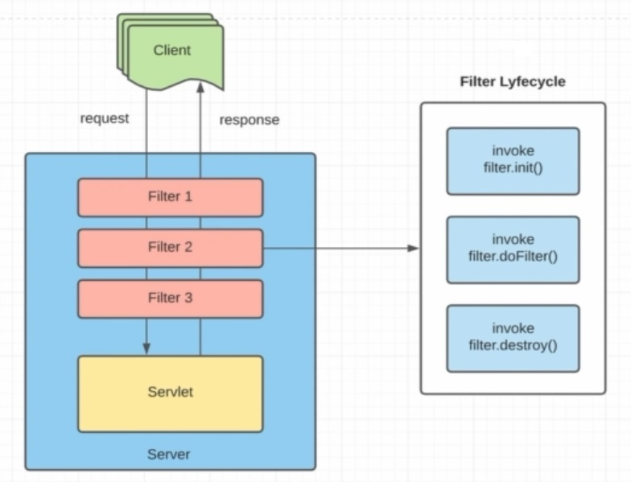

- **См. исходн. (ENG): [Interface Filter](https://jakarta.ee/specifications/platform/9/apidocs/jakarta/servlet/filter)**

### Interface Filter

```
  jakarta.servlet
```

**Все известные реализующие классы:** 
- [GenericFilter](https://jakarta.ee/specifications/platform/9/apidocs/jakarta/servlet/genericfilter),
- [HttpFilter](https://jakarta.ee/specifications/platform/9/apidocs/jakarta/servlet/http/httpfilter)

```
  public interface Filter
```

**Фильтр — это объект, который выполняет задачи фильтрации либо по запросу
к ресурсу (сервлету или статическому содержимому), либо по ответу от ресурса,
либо по тому и другому.**

Фильтры выполняют фильтрацию в методе doFilter. Каждый фильтр имеет доступ
к объекту FilterConfig, из которого он может получить свои параметры инициализации,
и ссылку на ServletContext, которую он может использовать, например, для загрузки
ресурсов, необходимых для задач фильтрации.

Фильтры настраиваются в дескрипторе развертывания веб-приложения.

Примеры, которые были определены для этой конструкции:

1.Фильтры аутентификации
2.Фильтры регистрации и аудита
3.Фильтры преобразования изображений
4.Фильтры сжатия данных
5.Фильтры шифрования
6.Фильтры токенизации
7.Фильтры, запускающие события доступа к ресурсам
8.XSL/T-фильтры
9.Цепной фильтр мим-типа

---
### Методы

---
`default void destroy()` - Вызывается веб-контейнером, чтобы указать фильтру, что он выводится из эксплуатации.

Вызывается веб-контейнером, чтобы указать фильтру, что он выводится из эксплуатации.

Этот метод вызывается только после завершения всех потоков в методе фильтра doFilter
или по истечении периода времени ожидания. После того как веб-контейнер вызовет этот
метод, он больше не будет вызывать метод doFilter для этого экземпляра фильтра.

Этот метод дает фильтру возможность очистить любые удерживаемые ресурсы (например,
память, дескрипторы файлов, потоки) и убедиться, что любое постоянное состояние
синхронизировано с текущим состоянием фильтра в памяти.

---
`void doFilter(ServletRequest request, ServletResponse response, FilterChain chain)` - Метод doFilter фильтра 
вызывается контейнером каждый раз, когда пара запрос/ответ проходит через цепочку из-за запроса клиента на ресурс
в конце цепочки.

Метод doFilter фильтра вызывается контейнером каждый раз, когда пара запрос/ответ
проходит через цепочку из-за запроса клиента на ресурс в конце цепочки. FilterChain,
переданный этому методу, позволяет фильтру передавать запрос и ответ следующему
объекту в цепочке.

**Типичная реализация этого метода будет следовать следующему шаблону:**
1. Проверяет запрос.
2. При необходимости оборачивает объект запроса пользовательской реализацией для фильтрации содержимого или заголовков для фильтрации ввода.
3. При необходимости оборачивает объект ответа пользовательской реализацией для фильтрации содержимого или заголовков для фильтрации вывода.
4. Либо вызывает следующую сущность в цепочке, используя объект FilterChain (chain.doFilter()), или не передавать пару запрос/ответ следующему объекту в цепочке фильтров, чтобы заблокировать обработку запроса.
5. Непосредственно задает заголовки ответа после вызова следующего объекта в цепочке фильтров.

**Параметры:**
request - объект ServletRequest содержит запрос клиента;
response - объект ServletResponse содержит ответ фильтра;
chain - FilterChain для вызова следующего фильтра или ресурса;

**Исключения:**
IOException - если во время обработки произошла ошибка, связанная с вводом-выводом;
ServletException - если возникает исключение, которое мешает нормальной работе фильтра;

---
`default void init(FilterConfig filterConfig)` - Вызывается веб-контейнером, чтобы указать фильтру, что он вводится в эксплуатацию.

Вызывается веб-контейнером, чтобы указать фильтру, что он вводится в эксплуатацию.

Контейнер сервлета вызывает метод init ровно один раз после создания экземпляра
фильтра. Метод init должен успешно завершиться, прежде чем фильтру будет предложено
выполнить какую-либо работу по фильтрации.

**Веб-контейнер не может ввести фильтр в эксплуатацию, если метод init либо:**
- выбросил исключение сервлета;
- не возвращается в течение периода времени, определенного веб-контейнером;

**Параметры:**
filterConfig - объект FilterConfig, содержащий параметры конфигурации и инициализации фильтра.

**Исключения:**
ServletException - если произошло исключение, мешающее нормальной работе фильтра.

**Спецификация реализации:**
Реализация по умолчанию не предпринимает никаких действий.

---
Схематично процесс работы фильтра показан на рис. 



---
- **[См. исходн. статью (ENG): Interface Filter](https://jakarta.ee/specifications/platform/9/apidocs/jakarta/servlet/filter)**

---
**Доп. материалы:**
- [Java Servlet Filter](https://www.geeksforgeeks.org/java/java-servlet-filter/)
- [Advanced Java — Filter (Servlet)](https://medium.com/@SachinPandeyOnline/advanced-java-filter-servlet-21cac1e6cc28)
- [Java Servlet Filter Example Tutorial](https://www.digitalocean.com/community/tutorials/java-servlet-filter-example-tutorial)
- [Introduction to Intercepting Filter Pattern in Java](https://www.baeldung.com/intercepting-filter-pattern-in-java)
- [Java EE Tutorials - Servlet Filters](https://www.cmwolfe.net/posts/2015/07/java-ee-tutorials---servlet-filters/)
- [Filter in Servlet (from Java Training School)](https://javatrainingschool.com/filter-in-servlet/)
- [Looking for an example for inserting content into the response using a servlet filter](https://stackoverflow.com/questions/14736328/looking-for-an-example-for-inserting-content-into-the-response-using-a-servlet-f)
- [Filter code with Servlet 2.3](https://www.servlets.com/soapbox/filters.html)
